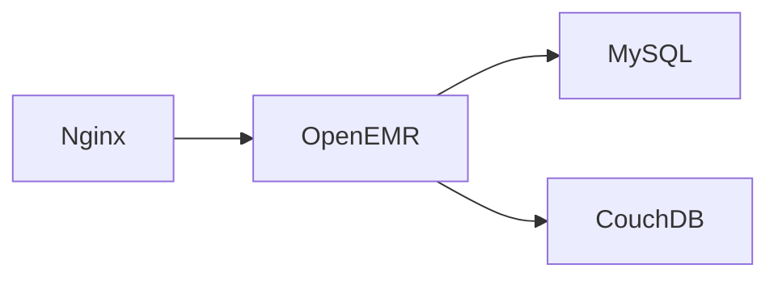

# System Architecture

```mermaid
graph LR
    Nginx --> OpenEMR
    OpenEMR --> MySQL
    OpenEMR --> CouchDB
```

The setup uses Nginx as a reverse proxy in front of the OpenEMR container. MySQL stores the application data and CouchDB is optional for modules that require it.
