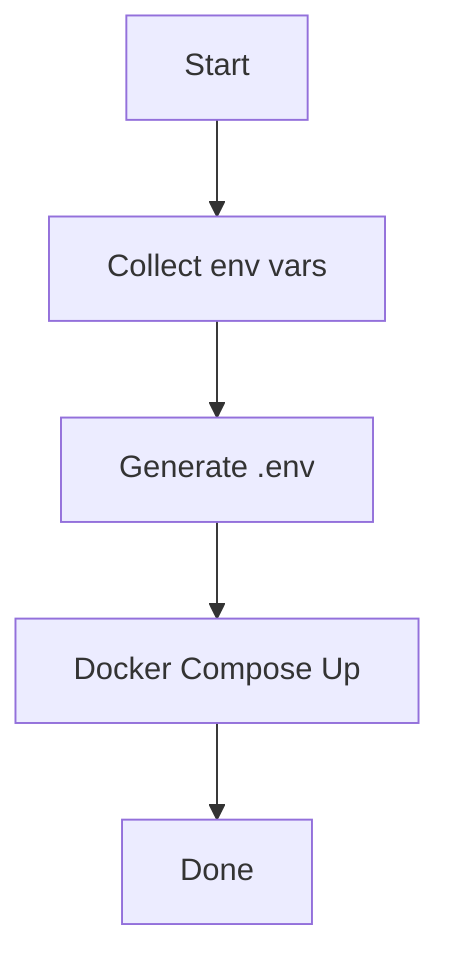
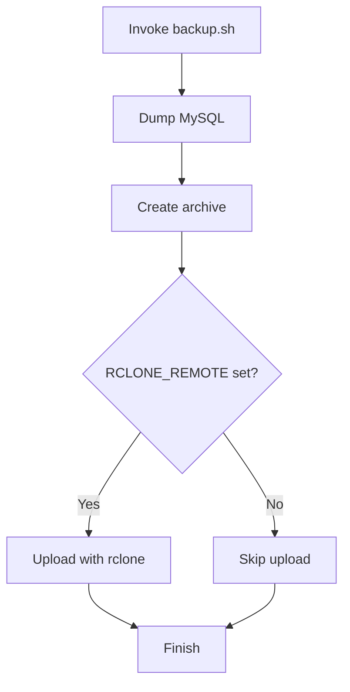

# Process Flowcharts

## Setup Script

```mermaid
flowchart TD
    A[Start] --> B[Collect env vars]
    B --> C[Generate .env]
    C --> D[Docker Compose Up]
    D --> E[Done]
```

## Backup Script

```mermaid
flowchart TD
    A[Invoke backup.sh] --> B[Dump MySQL]
    B --> C[Create archive]
    C --> D{RCLONE_REMOTE set?}
    D -- Yes --> E[Upload with rclone]
    D -- No --> F[Skip upload]
    E --> G[Finish]
    F --> G[Finish]
```
